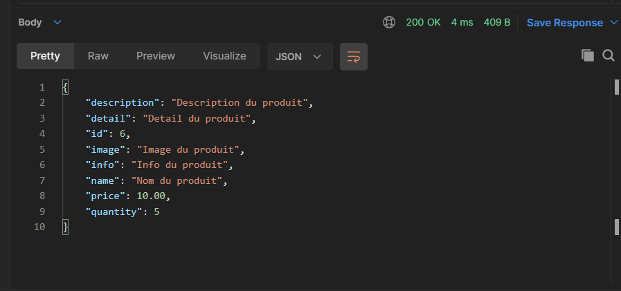

# API JaxRS + Glassfish + Hibernate(MySQL)

Api qui expose des produits Utilise une in-memory database par défaut mais il est possible de changer le repository pour
utiliser une base de donnée avec hibernate

## Installation Hibernate + MySQL pour Glassfish

https://dev.mysql.com/doc/connector-j/5.1/en/connector-j-usagenotes-glassfish-config.html

Nom du JNDI pour la pool : mySQLPool

Le fichier populate.sql à été mise à disposition pour construire et populer les tables rapidement.

## Routes disponibles

| Methode | Endpoint                         | Description                                |
|---------|----------------------------------|--------------------------------------------|
| GET     | /v1/products                     | Récupère tout les produits                 |
| POST    | /v1/products                     | Ajoute un produit                          |
| DELETE  | /v1/products                     | Supprime tout les produits                 |
| GET     | /v1/products/{id}                | Récupère un produit par son id             |
| POST    | /v1/products/{id}                | Ajouter un produit avec un id              |
| DELETE  | /v1/products/{id}                | Supprime un produit par son id             |
| GET     | /v1/products/search/{name}       | Récupère un produit par son nom            |
| POST    | /v1/products/buy/{id}/{quantity} | Achète un produit pour une quantité donnée |

## Example d'appel d'une route

### Récupérer tout les produits

    curl --location --request GET 'http://localhost:8085/api/v1/products'

### Ajouter un produit

    curl --location --request POST 'http://localhost:8085/api/v1/products' \
        --header 'Content-Type: application/json' \
        --data-raw '{
            "name": "Nom du produit",
            "detail": "Detail du produit",
            "price": 10.00,
            "quantity": 5,
            "info": "Info du produit",
            "description": "Description du produit",
            "image": "Image du produit"
        }'

Exemple de réponse:

